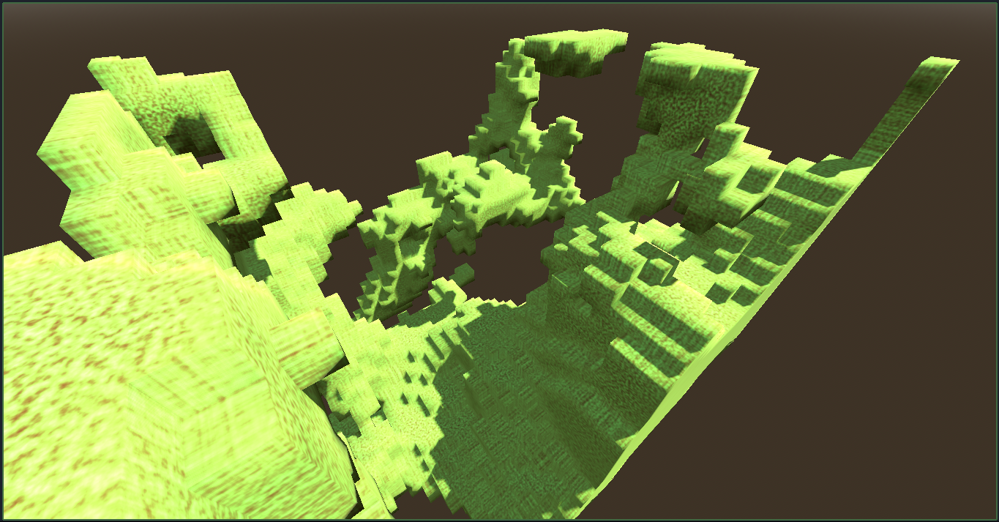
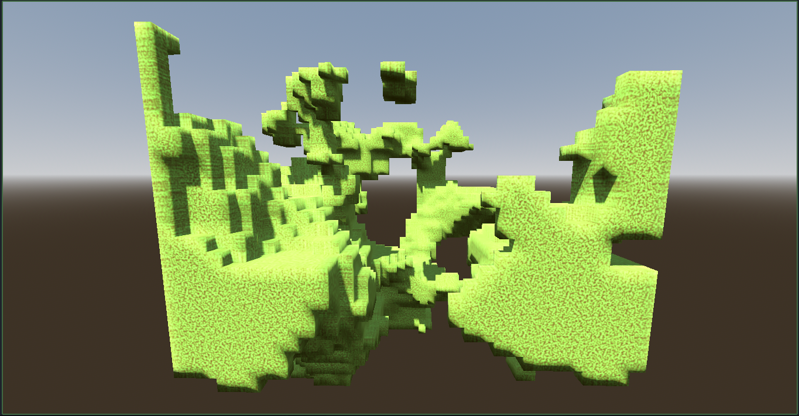
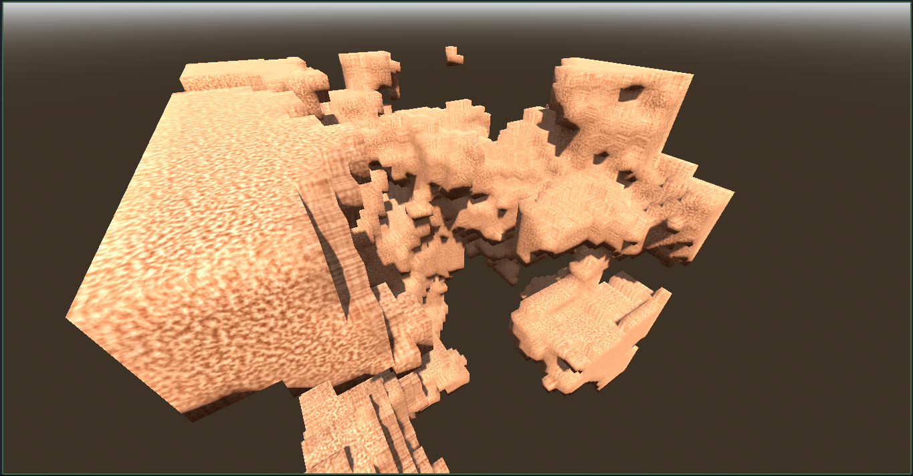

# Procedural VOXEL Terrain Generator for Godot
A simple Minecraft-style Procedural Voxel Terrain generation for Godot 4 based on MeshInstance3D and 3D noise. This is a simple, quick draft.

    

# Usage
1. Attach the `VoxelMesh.gd` script to a **Node3D**.
2. **Set the Noise:** Set fast noise lite.
3. Adjust the **Chunk size** property to control the terrain size. Be careful - **large values** slow down the editor a lot!
4. Set another parameters - inverse noise, material, etc.

Tested on Godot 4.4. It’s public domain, so use it however you want!

# Screenshots

    
    

# Disadvantages:
1. The algorithm is very simple.
2. Large terrain require a lot of computing power.
3. No UV, use triplanar materials.
